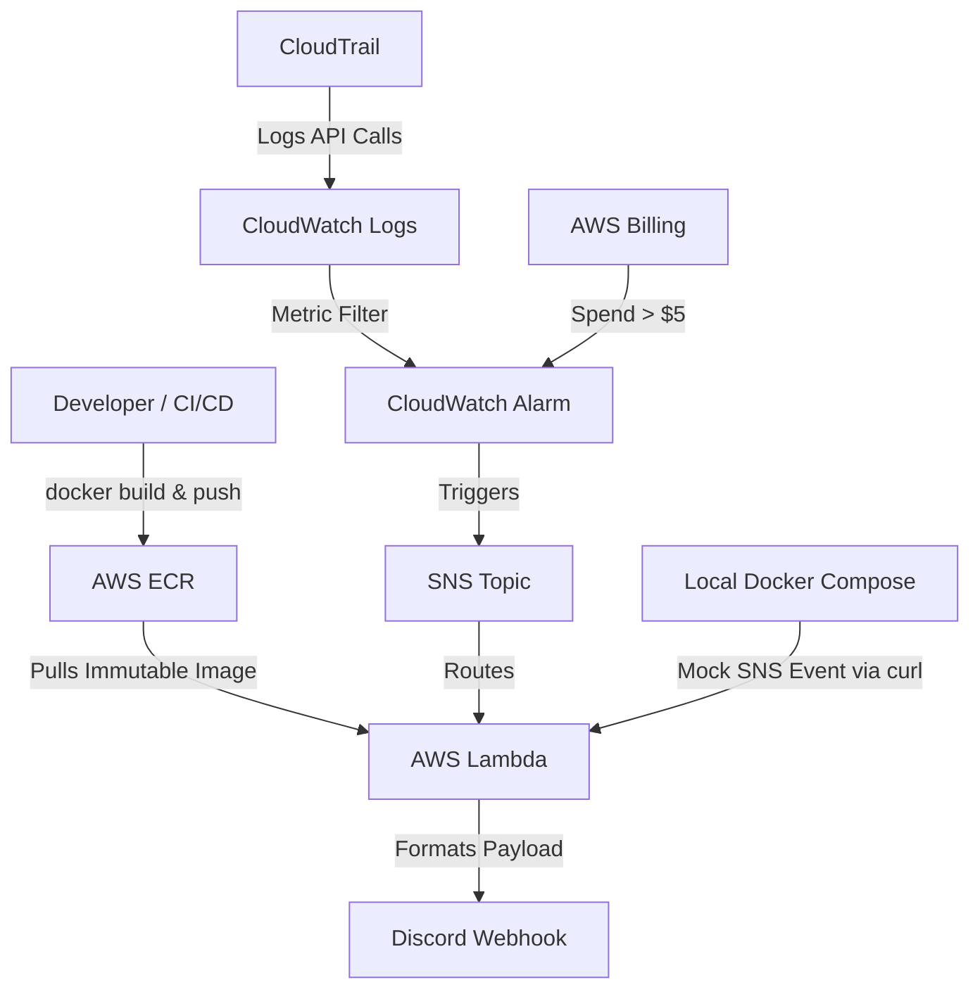

# AWS Infrastructure Health Dashboard & Alert System

A production-grade, serverless AWS monitoring and alerting pipeline built with Terraform and deployed via Docker/ECR. This project automatically detects security anomalies (like unauthorized IAM user creation) and budget thresholds, routing clean, human-readable alerts directly to Discord.


## Architecture Overview



## Key Features & Security Implementations

- **Immutable Container Deployments:** Lambda function is packaged as a Docker container and stored in AWS ECR with IMMUTABLE tags. The `deploy.sh` script generates unique timestamp tags (e.g., `v20260416-143022`), guaranteeing deployment consistency and making rollbacks trivial.
- **Security First:**
  - **Secrets Management:** The Discord Webhook URL is stored in AWS SSM Parameter Store as a `SecureString`. The Terraform state and codebase contain zero plaintext secrets.
  - **Dynamic Infrastructure:** S3 bucket names are dynamically generated using Terraform's `random_id` resource to prevent naming collisions in shared or multi-developer environments.
  - **Vulnerability Scanning:** ECR is configured to automatically scan container images for vulnerabilities on every push.
  - **S3 Protection:** CloudTrail logs are encrypted at rest using SSE-S3, and S3 Public Access Block is explicitly enabled to prevent data leaks.
- **Event-Driven Architecture:** Serverless pipeline using SNS → Lambda to translate raw AWS JSON alerts into clean, formatted Discord embeds for human readability.
- **Robust Error Handling:** The Python code includes defensive programming practices, catching malformed SNS events gracefully and preventing silent Lambda crashes.
- **Local Development:** Use Docker Compose to run the Lambda runtime locally against a mock SNS event for rapid testing without incurring AWS costs. Includes a health check to verify the container is ready before testing.

## Prerequisites

- An AWS Account
- **Docker**
- **Terraform**
- AWS CLI configured with credentials (`aws configure`)
- A Discord Webhook URL

## Setup & Deployment

### 1. Securely store your Discord Webhook (Critical First Step)

We never hardcode secrets in Terraform. Instead, we pass the webhook to AWS Systems Manager Parameter Store (SSM), which encrypts it using KMS.

Run this command in your terminal:

```bash
aws ssm put-parameter \
  --name "/health-dashboard/discord-webhook" \
  --value "PASTE_YOUR_DISCORD_WEBHOOK_URL_HERE" \
  --type "SecureString" \
  --region us-east-1
```

> **Note:** Do not wrap the URL in quotes in your terminal.

### 2. Configure your variables

Open `variables.tf` and update the `default` value for `alert_email` to your actual email address.

### 3. Deploy via the automated script

The included `deploy.sh` script handles everything: building the Docker image, pushing it to ECR with a unique timestamp tag, running `terraform init`, and applying the infrastructure.

```bash
chmod +x deploy.sh
./deploy.sh
```

### 4. Manual CloudTrail Link (AWS API Workaround)

Due to a known AWS bug (`InvalidCloudWatchLogsLogGroupArnException`), Terraform cannot natively attach CloudWatch Logs to CloudTrail in certain environments. After deployment, manually link them:

1. Go to **AWS Console → CloudTrail → `SecurityAuditTrail`**
2. Click **Edit** under "CloudWatch Logs"
3. Select the `CloudTrail/SecurityAudit` log group and `CloudTrailToCloudWatchRole`
4. Click **Save**

## Local Development & Testing

You can test the Lambda function locally without deploying to AWS.

**1. Create your local environment file:**

```bash
echo "WEBHOOK_URL=your_discord_webhook_url_here" > .env
```

**2. Start the local Lambda runtime:**

```bash
docker-compose up --build
```

**3. Trigger a test event:** In a separate terminal, simulate an SNS message using the provided mock event:

```bash
curl -XPOST "http://localhost:9000/2015-03-31/functions/function/invocations" \
  -H "Content-Type: application/json" \
  -d @test_event.json
```

Check your Discord channel for the alert!

## Testing the AWS Pipeline

Once deployed, trigger a simulated security event in AWS:

```bash
aws iam create-user --user-name TestUser --region us-east-1
```

Wait ~5 minutes for the alarm evaluation period, then check your Discord channel. Clean up the test user afterwards:

```bash
aws iam delete-user --user-name TestUser --region us-east-1
```

## Teardown

To avoid ongoing AWS charges, destroy the infrastructure when not in use:

```bash
terraform destroy
```

> **Note:** Because the CloudTrail S3 bucket does not have `force_destroy = true`, you may need to manually empty the S3 bucket via the AWS Console if `terraform destroy` fails.

## Architectural Notes & Technical Debt

This project documents real-world engineering decisions:

- **Immutable Artifacts:** The ECR repository is set to `IMMUTABLE`. The deployment script uses timestamp-based tags (e.g., `v20260416-143022`) to ensure images are never overwritten, allowing for instant, safe rollbacks by passing a previous tag to Terraform.
- **Dynamic Infrastructure:** The S3 bucket name is dynamically generated using Terraform's `random_id` resource. This prevents deployment failures if multiple developers deploy the exact same code to the same AWS account.
- **CloudTrail Lifecycle Drift:** The CloudTrail resource uses a `lifecycle { ignore_changes }` block on its CloudWatch Logs integration fields. This is a conscious workaround for a broken AWS API validation bug, not accidental drift suppression. In enterprise environments, this would be paired with AWS Config to ensure the security link remains active.
- **Dead Letter Queues (DLQ):** The Lambda function omits a DLQ for brevity, but architectural comments document how silent failures would be handled in a production SLO environment.
