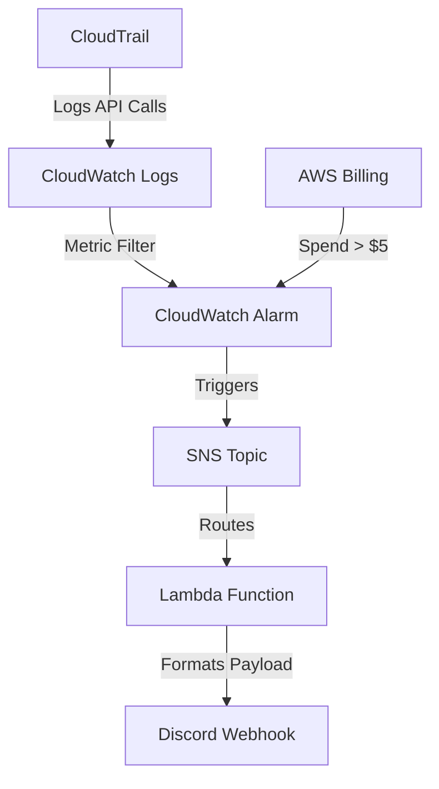

# AWS Infrastructure Health Dashboard & Alert System

A production-grade, serverless AWS monitoring and alerting pipeline built entirely with Infrastructure as Code (Terraform). This project automatically detects security anomalies (like unauthorized IAM user creation) and budget thresholds, routing clean, human-readable alerts directly to Discord.


## Architecture Overview



## Key Features & Security Implementations

- **Infrastructure as Code:** 100% provisioned via Terraform. No manual console clicks (with noted exception for a known AWS API bug).
- **Security First:**
  - Secrets management via AWS SSM Parameter Store (Terraform state contains zero plaintext secrets).
  - CloudTrail logs encrypted at rest using SSE-S3.
  - S3 Public Access Block explicitly enabled to prevent data leaks.
- **Event-Driven Architecture:** Serverless pipeline using SNS → Lambda to translate raw AWS JSON alerts into clean, formatted Discord embeds for human readability.
- **Observability:** Custom CloudWatch Dashboard tracking Lambda invocations, errors, and billing status in real-time.

## Prerequisites

- An AWS Account
- **Terraform** installed locally
- AWS CLI configured with credentials (`aws configure`)
- A Discord Webhook URL

## Setup & Deployment

**1. Store your Discord Webhook securely in AWS SSM:**

```bash
aws ssm put-parameter \
  --name "/health-dashboard/discord-webhook" \
  --value "YOUR_DISCORD_WEBHOOK_URL" \
  --type "SecureString" \
  --region us-east-1
```

**2. Clone/download the repository and initialize Terraform:**

```bash
cd aws-health-dashboard
terraform init
```

**3. Configure your variables:**

Open `variables.tf` and update the `default` value for `alert_email` to your actual email address.

**4. Review the execution plan:**

```bash
terraform plan
```

**5. Apply the infrastructure:**

```bash
terraform apply
```

**6. Manual CloudTrail Link (AWS API Workaround):**

Due to a known AWS bug (`InvalidCloudWatchLogsLogGroupArnException`), Terraform cannot natively attach CloudWatch Logs to CloudTrail in certain environments. After `terraform apply` succeeds, manually link them:

1. Go to **AWS Console → CloudTrail → `SecurityAuditTrail`**
2. Click **Edit** under "CloudWatch Logs"
3. Select the `CloudTrail/SecurityAudit` log group and `CloudTrailToCloudWatchRole`
4. Click **Save**

## Testing the Pipeline

Trigger a simulated security event to watch the pipeline in action:

```bash
aws iam create-user --user-name TestUser --region us-east-1
```

Wait ~5 minutes for the alarm evaluation period, then check your Discord channel.

Clean up the test user afterwards:

```bash
aws iam delete-user --user-name TestUser --region us-east-1
```

## Teardown

To avoid ongoing AWS charges, destroy the infrastructure when not in use:

```bash
terraform destroy
```

> **Note:** Because the CloudTrail S3 bucket does not have `force_destroy = true` (a security best practice to prevent accidental data loss), you may need to manually empty the S3 bucket via the AWS Console if `terraform destroy` fails at the very end. Alternatively, manually delete the CloudTrail in the Console first, which automatically removes its log files, allowing Terraform to clean up the empty bucket.

## Architectural Notes & Technical Debt

This project documents real-world engineering decisions.

The CloudTrail resource uses a `lifecycle { ignore_changes }` block on its CloudWatch Logs integration fields. This is a conscious workaround for a broken AWS API validation bug, not accidental drift suppression. In an enterprise environment, this would be paired with an independent compliance check (e.g., AWS Config) to ensure the security link remains active and is never silently broken.

The Lambda function includes architectural comments regarding the omission of a Dead Letter Queue (DLQ), acknowledging how silent failures would be handled in a production SLO environment.
